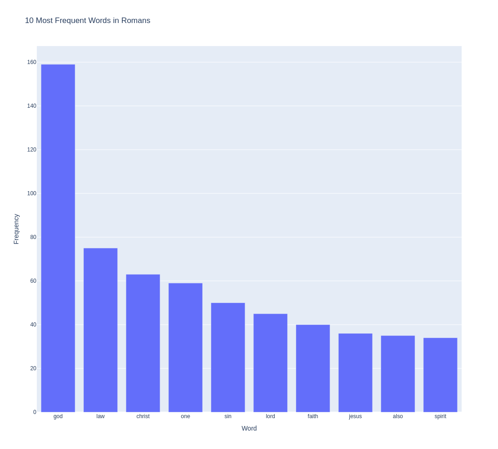

# Logoi

## 📜 Description
Logoi reads and cleans biblical translations before performing one of many possible natural language processing analyses. Its current build focuses on the following analyses:
- Word Frequency 
- Collocation 
- N-gram
- Keyword
- Sentiment
- Lexical Diversity

### Demo


## 🔥 Motivation
**I wanted a tool that would help me engage with various Biblical translations *linguistically***. More than that, I wanted a tool that could make sense of all the words in the Word, something that would tell a story through them, of their original meaning, and of the editorial decisions which have contributed to that meaning across time.

Logoi is greek for "words". *But it can also mean "reasons" or "senses"*. It is a tool that, with continuing development, will allow us to study Scripture through modern natural language processing techniques. My hope is that this will especially aid future biblical scholars. In that way, it will enhance our senses in reading scripture by scrutinizing its words, phrases, chapters and books.

### Major Analyses:
1. **Word Frequency Analysis**:
    - Determine the most frequent words in each book, across the entire Bible, or within specific sections (e.g., Old Testament vs. New Testament). 
    - *Can reveal key themes and vocabulary.*
2. **Collocation Analysis**: 
    - Identify words that frequently appear together. 
    - *Highlights relationships between concepts and recurring phrases.*
3. **N-gram Analysis**: 
    - Explore sequences of words (bigrams, trigrams, etc.) to find common phrases and patterns in the text.   
4. **Keyword Extraction**: 
    - Use algorithms to identify the most important words and phrases. 
    - *Helpful for summarizing content.*   
5. **Sentiment Analysis**: 
    - Analyze emotional tone across different books or passages. 
    - *Are certain books more positive or negative in their language?* 
6. **Lexical Diversity**: 
    - Measure the richness of vocabulary used in different books. 
    - *Which sections have the widest selection of words?*
    - *Which authors share vocabulary?*

## 🚀 Quick Start
### 1. Clone the Repository
```
git clone https://github.com/josequiceno2000/logoi.git
cd logoi
```
### 2. Create & Activate Virtual Environment (Recommended)
```
python3 -m venv logoi
source env/bin/activate # On Windows: env\Scripts\activate
```

### 3. Install Requirements
```
pip instal -r requirements.txt
```

### 4. Run Logoi
```
python3 main.py
```

Logoi will clean the raw Bible text, perform preprocessing, and output word frequencies by book and section.

## 🛠️ Usage
Once Logoi is installed, using it is pretty straightforward:
### Run the Program
```
python3 main.py
```
### Under the Hood
Running `main.py` walks you through
#### Intro & Selection
- You will be primpted to choose your preferred **analysis type** (currently suports **Word Frequency**)
- Then, you will select a **Bible translation** (e.g., *New Revised Standard Version - Catholic Edition*)
#### Data Preparation
- Loads and structures biblical text into a DataFrame
- Cleans the text: removes noise, punctuation, and standardizes formatting.
- Preprocsses words: tokenization, stopword removal, lemmatization, etc.
#### Analysis
- Calculates word frequencies **per book** (e.g., Romans, Genesis) using `collections.Counter`.
#### Export
- Automatically saves the data into a `.csv` file in a newly-made `analyses/` directory.
#### Visualization
- Plots the most frequent words in the selected book using a horizontal bar chart.
### Output Files
- **CSV Export**
    Located in:
    ```
    analyses/{translation}/word_frequencies.csv
    ```
    Each row contains a biblical book and its top words with respective frequencies.
- **Chart Example**
    After the analysis, a plot of the most common words in *Romans* is displayed using `matplotlib`. **The chart is interactable and downloadable**!
    
#### Try Modifying It
Want to see the plot for another book? Change the call to:
```
plot_top_words(biblical_book_frequencies["Genesis"], "Genesis")
```
Want to try different sections or run other analyses? Stay tuned!
OR... contribute!

## 🤝 Contributing